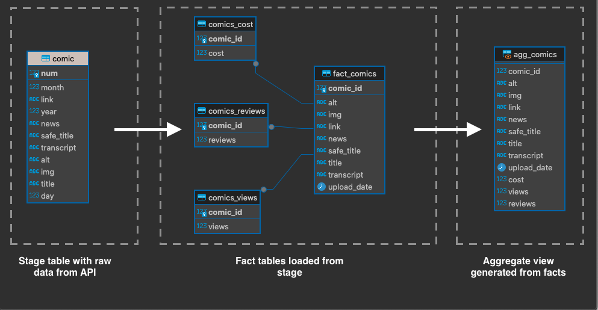

# XKCD Webcomics extractor

This pipeline is extracting data from the XKCD webcomics API (https://xkcd.com/json.html) to a postgres database using Airflow and dbt.\
The Airflow DAG is scheduled to run every Monday, Wednesday and Friday, using a Sensor to check the API server for new comics, so they are loaded as soon as they are available.\
The data captured from the API is being loaded to the below data warehouse using dbt transformations.




Execution steps:

1. Clone repository

    ```console
    git clone https://github.com/borosadi/jet_xkcd_webcomics.git
    ```
2. Run docker compose in the airflow-docker library
    ```console
    cd airflow-docker
    ```
    ```console
    docker compose up -d
    ```

    

    this step will create the airflow webserver
    and a postgres database

3. Now we can access the Airflow server on localhost\

    http://localhost:8080

    Username: airflow\
    Password: airflow

    

4. Run Load_Raw_Comics DAG
    

5. The database created in step 2. is accessable through localhost port 5439

    Host: localhost\
    Port: 5439\
    Database: airflow\
    Username: airflow\
    Password: airflow

    

6. Query schema

    
